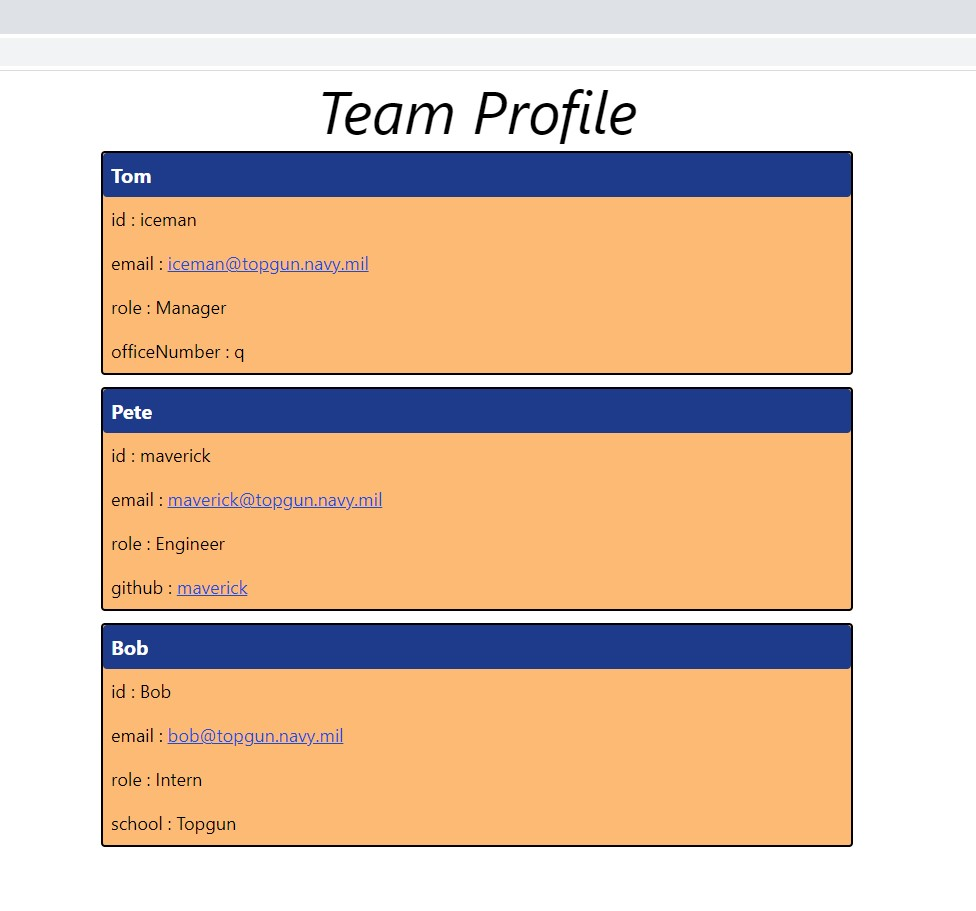

# BP-Team-Profile-Generator

GT Coding Bootcamp Challenge 10

---

## Table of Contents

- [BP-Team-Profile-Generator](#bp-team-profile-generator)
  - [Table of Contents](#table-of-contents)
  - [Description](#description)
  - [Installation](#installation)
  - [Usage](#usage)
  - [License](#license)
  - [Tests](#tests)
  - [Contributing](#contributing)
  - [Questions](#questions)
  - [Screenshot](#screenshot)
  - [Demo Video](#demo-video)

## Description

      Creates an easy-to-use reference to my team's contact information and thier job titles.

## Installation

      Clone the app from my github.

      You must have Node and Inquirer 8.2.4 installed to run this app.

      Type npm install inquirer@8.2.4 to install the required dependencies

## Usage

      Type 'node index.js' to initiate this app. Follow the prompts to add team members and generate the HTML.

      Open index.html in your browser to view the results.

## License

Licensed under the [MIT](https://choosealicense.com/licenses/mit/) license;

Copyright © 2022. All rights reserved.

## Tests

      Unit tests were created and executed using the Jest framework

## Contributing

      Please submit suggested changes as a new branch on my github, or contact me as listed below

## Questions

- ### email
  <a href="mailTo: bp4924@gmail.com?subject=Hello!" alt="" >bp4924@gmail.com</a>
- ### GitHub
  [bp4924](https://github.com/bp4924)
- ### LinkedIn
  [berniepetters](https://linkedin.com/in/berniepetters)

## Screenshot

## Demo Video

https://watch.screencastify.com/v/H3Fx0t2LXEaky0LiYaU6
